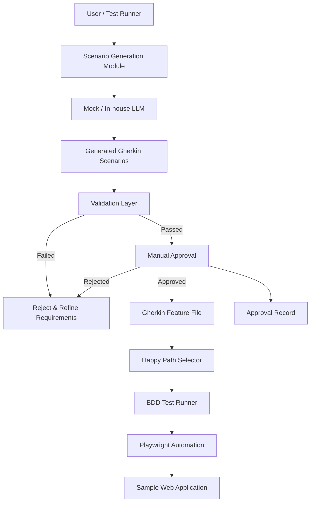

# LLM-Assisted BDD Functional Testing - Sample Web Application

## Overview

This project demonstrating a complete BDD (Behavior-Driven Development) pipeline for a Flask web application. It features a unique **LLM-assisted scenario generation** capability where Gherkin test scenarios are automatically generated from plain-English business requirements.

**Note:** To ensure reliability and avoid external API dependency issues (quotas, billing), the project currently uses a **Mock LLM Client**. This validates the architectural pattern of LLM integration without requiring an active API key, while preserving the exact same data flow and validation logic.

---

## Architecture

## High-Level Architecture



### Component Breakdown

#### 1. **Scenario Generation Module** (New)
- **`generate_scenarios.py`**: The orchestrator that reads requirements, calls the LLM client, validates the output, and handles user approval.
- **`llm_client.py`**:  A modular client designed to interface with LLM APIs. *Currently implements a Mock strategy for robust local testing.*
- **`requirements.txt`**: Plain-English business rules used as input.

#### 2. **Flask Web Application**
- **Technology**: Python Flask
- **Purpose**: Simple web app with login, dashboard, and admin features
- **Architecture**: Blueprint-based modular design

#### 3. **BDD Test Framework**
- **Technology**: pytest-bdd + Playwright (Synchronous API)
- **Purpose**: Automated browser-based testing

---

## Project Structure

```
sample_bdd_app/
│
├── app/ # Flask application
│
├── llm/ # LLM Integration Layer
│ ├── init.py
│ ├── mock_client.py # Mock LLM implementation
│ └── scenario_generator.py # Scenario generation workflow
│
├── tests/ # BDD test suite
│ ├── features/ # Gherkin feature files
│ ├── steps/ # Step definitions
│ ├── conftest.py # Pytest fixtures
│ └── test_runner.py # Test orchestration
│
├── approvals/ # Approval and audit records
│ └── scenario_approval.json
│
├── requirements.txt # Business requirements input
├── run_happy_paths.py # Happy-path test runner
├── run.py # Flask app entry point
├── pytest.ini # Pytest configuration
├── test.md # UI strings reference
└── README.md # Project documentation

```

---

## File Descriptions

### Application Files

| File | Purpose | Role in Project |
|------|---------|-----------------|
| `generate_scenarios.py` | Scenario Orchestrator | Reads requirements, validates LLM output, forces review |
| `llm_client.py` | LLM Interface | Abstraction layer for AI calls. Currently mocks response |
| `requirements.txt` | Input | The source of truth for business requirements |
| `run_happy_paths.py` | Happy Path Runner | Filters and executes only positive test scenarios |
| `test.md` | UI strings catalog | Documents all user-visible text for LLM reference |

---

## Justification for Mock LLM

The `llm_client.py` is intentionally configured to run in **Mock Mode**. 

**Why?**
1.  **Reliability**: Eliminates flaky tests caused by network issues or API outages.
2.  **Cost/Quota**: Avoids hitting API rate limits or incurring costs during development and demonstration.
3.  **Consistency**: Ensures the "LLM" output is always deterministic, making the pipeline easier to debug.

**Architectural Integrity:**
Despite being a mock, the architecture is **production-ready**. To switch to a real LLM (like OpenAI GPT-4), you only need to update the `generate_gherkin` function in `llm_client.py`. The rest of the pipeline (`generate_scenarios.py`, validation logic, file writing) requires **zero changes**.

---

## Project Flow

### 1. **Scenario Generation Flow**

```
requirements.txt 
       ↓
generate_scenarios.py reads input
       ↓
Calls llm_client.py (Returns generated Gherkin)
       ↓
Validates Syntax (Must have Given/When/Then, Happy/Negative paths)
       ↓
User Manual Approval (CLI Prompt)
       ↓
Writes to features/user_authentication.feature
Writes audit record to approvals/scenario_approval.json
```

### 2. **Test Execution Flow**

```
run_happy_paths.py filters feature file
       ↓
Identifies "Happy Path" scenarios (Regex match)
       ↓
executes via pytest-bdd
       ↓
Browser validation (Playwright)
```

---

## Setup & Execution

### Prerequisites

- Python 3.10+
- pip

### Step 1: Install Dependencies

```bash
pip install -r rqt.txt
python -m playwright install
```

### Step 2: Start the Flask Application

**Terminal 1:**
```bash
python run.py
```
The app will run on `http://127.0.0.1:5000`

### Step 3: Generate Scenarios

**Terminal 2:**
```bash
python generate_scenarios.py
```
- Accepts the mock generation
- Approves the file creation

### Step 4: Run Happy Path Tests

**Terminal 2:**
```bash
python run_happy_paths.py
```
- Validates the generated scenarios against the running app

---

## License

This is a sample project for educational purposes.
